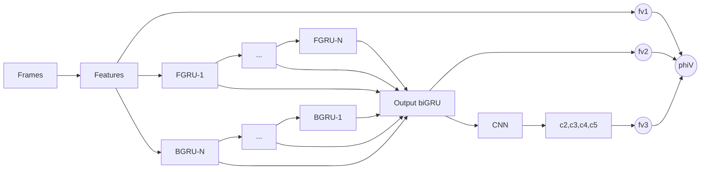
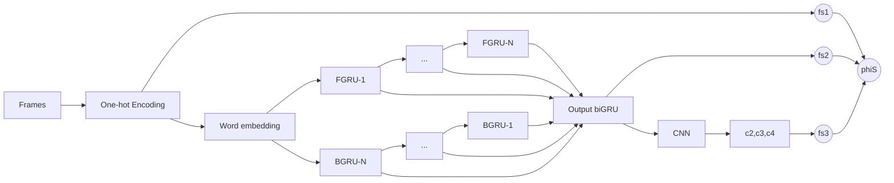

# Dual Encoding for Zero-Example Video Retrieval
## Descripción detallada del problema

### Motivación

La motivación del artículo es poder crear un modelo capaz de codificar oraciones y videos bajo una misma representación sin la necesidad de extraer conceptos de relevancia que relacionan a ambos contextos. En otras palabras, el modelo debe ser capaz de entender la semántica entre ambos dominios a partir de un método libre de contexto.

Esto resulta interesante al extrapolar este problema, ya que entrega evidencia que se pueden relacionar dos dominios distintos sin la necesidad de extraer características relevantes de alguno de los dos, teniendo en cuenta que se considera la variable temporal entre ambos dominios.

### Problema
El problema que se aborda es el de llevar el dominio léxico y el dominio visual a un espacio común donde se pueden comparar. La complejidad que tiene el problema está en los dominios tratados, ya que ambos tienen la variable temporal involucrada. No basta con que el modelo relacione las características relevantes de ambos dominios, sino que también debe considerar el orden temporal de aquellas.

La hipótesis del artículo es que dado un video o una query, en primera instancia, estos deben ser codificados en una poderosa representación por si misma para luego aprovechar ambas representaciones con un modelo de redes neuronales [[1]].

[1]: https://arxiv.org/pdf/1809.06181.pdf

### Relevancia
El artículo tiene suma **relevancia** al cambiar el paradigma de los modelos basados en conceptos, los cuales automáticamente detectan los conceptos relevantes y los asocian a un evento en particular. Estos tipos de modelos tienen la dificultad de escoger los conceptos para poder entrenarlos, no siendo una tarea simple el escoger conceptos que se puedan detectar y además representar en ambos dominios simultáneamente.

### Planteamiento como problema de Aprendizaje de Máquina

Este problema se puede definir como un problema de ***Aprendizaje de Máquina*** de la siguiente manera: existen dos modalidades de inputs con sus respectivas modalidades de outputs.

La primera modalidad es el **video-to-text**, donde el input es un set de frames de video, o un conjunto de imágenes. En este caso, el output es una oración en lenguaje natural, es decir, una composición de palabras que describe semánticamente el fragmento de video que fue entregado como input.

La segunda modalidad o **text-to-video** es el caso en que el input es una oración en lenguaje natural y el output es un set de frames de video que son descrito semánticamente por el input.

## Descripción detallada de las métricas

Las métricas de evaluación que utilizaré son las mismas que se utilizaron en el paper y que describiré a continuación.

1. **Recall@K (R@K, K = 1, 5, 10):** Porcentaje de obtener al menos un elemento correctamente clasificado dentro de los K elementos con mayor probabilidad de aserción. El modelo tiene un **mejor** desempeño a **mayor R@K**.
2. **Suma de Recalls:** Debido a que se evalúan ambas modalidades, se obtienen más posibles respuestas correctas para la modalidad *video-to-text*, ya que hay múltiples oraciones correctas para un video, mientras sólo hay un video correcto para cada oración. Debido a esto, se requiere tener una comparación más fiable, por lo que se considera la suma de todos los Recalls (R@K, para K = 1, 5, 10) de ambas modalidades.
3. **[Median rank (Med r)]:** Es la mediana del rank. El i-ésimo rank se calcula como el error mínimo de un conjunto de errores considerando los primeros *i* elementos. A grandes rasgos, sirve para ignorar *outlayers* que puedan alterar el desempeño del modelo (ya sea para bien o para mal). El modelo tiene un **mejor** desempeño a **menor Med r**.
4. **Mean Average Precision (mAP):** Es el promedio de los Average Precision (AP) calculado para cada clase. El AP se calcula como el área bajo la curva de Precision v/s Recall. En este contexto, considerando la modalidad *video-to-text*, la clase está dada por todas las oraciones del dataset y con la modalidad *text-to-video*, la clase se representa como todos los videos.

[Median rank (Med r)]: [https://www.bmartin.cc/pubs/16aur/index.html](https://www.bmartin.cc/pubs/16aur/index.html)

## Descripción de los datos utilizados

**MSR-VTT Dataset**
Se utiliza el dataset MSR-VTT que contiene 10.000 *video clips* con 200.000 *oraciones de lenguaje natural* que describen el contenido de los videos, también denominadas *captions*. En promedio, se tienen 20 *captions* por video.

La partición que utilizaron para los datos de training, validation y testing son 6.513, 497 y 2.990 videos, respectivamente.

El modo de uso de cada video es mediante la agrupación de *n* frames que representan 0.5 segundos del video. Luego, se extraen las características o *features* de cada frame a través de una *red convolucional* pre-entrenada denominada **ImageNet CNN** y son estos grupos de *frames* los que se utilizan para realizar distintos cálculos, los que vienen siendo los **encodings globales**, **encodings de la *consciencia* temporal** y **encodings de mejoras locales.**

En consecuencia, los datos que se obtienen son los *features* de cada *frame* de los 10.000 videos en un archivo de formato binario (.bin) y los *captions* están en formato de texto (.txt).

**Vocabulario/Bag of Words (BoW)**
Para trabajar con texto se utilizaron word embeddings y debido a ello es necesario extraer el vocabulario del training set. Ejecuté el script *vocab.py* del repositorio el cual generó un vocabulario de **7.807** palabras.

**WordtoVec (W2V)**
Se trabaja con el word embedding pre-entrenado W2V que posee 1.743.364 instancias de palabras, cada una de dimensión 500. 

Los datos se pueden descargar ejecutando las celdas correspondientes del siguiente [Colab]. En este mismo ambiente se pueden observar los análisis de los datos que mencioné con anterioridad.

[Colab]: https://colab.research.google.com/drive/1JUQGNamMmAaJFmXqHoLISU4oQw3BEF4n

Además, encontré el código de los Dataloaders que utilizaron en el paper, también adjuntos en el link de Colab. 

## Descripción de la arquitectura

Como en el el paper hay dos modalidades de uso debido al *encoding dual*, existen dos arquitecturas, para las cuales haré una descripción de alto nivel seguido por la enumeración de las fórmulas.

### Primera modalidad: video-to-text

A partir de los frames de un video, se calculan sus *features*. El video queda representado por una secuencia de vectores característicos $\{v_1, v_2, ..., v_n\}$ donde $v_t$ representa los *features* del t-ésimo frame.

Se entregan los *features* a una red recurrente bidireccional (biGRU), donde el output del t-ésimo elemento está dado por la concatenación de la GRU forward y GRU backward: $h_t = [\overrightarrow{h_t}, \overleftarrow{h_t}]$. Juntando todo, se obtiene un mapa característico $H = \{h_1, h_2, ..., h_n\}$.

El mapa característico $H$ es entregado como input a una *red convolucional* (CNN) que utiliza filtros de tamaño $k=2,3,4,5$. El output final de esta red será definido como la concatenación de los outputs de la CNN para los distintos $k$.

**Level 1. Global Encoding by Mean Pooling**
$$f_v^{(1)} = \frac{1}{n}\sum_{t=1}^n v_t$$

**Level 2. Temporal-Aware Encoding by biGRU**
$$\overrightarrow{h_t} = \overrightarrow{GRU}(v_t,  \overrightarrow{h_{t-1}})$$
$$\overleftarrow{h_t} = \overleftarrow{GRU}(v_{n+1-t},  \overleftarrow{h_{t-1}})$$

$$f_v^{(2)} = \frac{1}{n}\sum_{t=1}^n h_t$$

**Level 3. Local-Enhanced Encoding by biGRU-CNN**
$$c_k = max-pooling(ReLU(Conv1d_{k,r}(H)))$$
$$f_v^{(3)} = [c_2, c_3, c_4, c_5]$$
$$\phi (v) = [f_v^{(1)}, f_v^{(2)}, f_v^{(3)}]$$

### Segunda modalidad: text-to-video

La arquitectura para la segunda modalidad es muy similiar a la primera, pero con pequeños cambios.

De partida, el input es una oración y se calculan los *vectores one-hot* de cada palabra que resulta en la secuencia $\{w_1, w_2, ..., w_m\}$ donde $w_t$ es el vector para la t-ésima palabra. El input del biGRU se calcula como la multiplicación del vector one-hot con una matriz del word embedding. Esta matriz es inicializada con word2vec ya mencionado. El output de la red biGRU es pasada como input a la red convolucional. Esta tiene la diferencia que se utilizan $k=2,3,4$ y el resultado final de la CNN es la concatenación de los $c_k$. Las fórmulas son idénticas, cambiando el argumento.

**Level 1. Global Encoding by Mean Pooling**
$$f_s^{(1)} = \frac{1}{n}\sum_{t=1}^n w_t$$

**Level 2. Temporal-Aware Encoding by biGRU**
$$\overrightarrow{h_t} = \overrightarrow{GRU}(w_t,  \overrightarrow{h_{t-1}})$$
$$\overleftarrow{h_t} = \overleftarrow{GRU}(w_{n+1-t},  \overleftarrow{h_{t-1}})$$

$$f_s^{(2)} = \frac{1}{n}\sum_{t=1}^n h_t$$

**Level 3. Local-Enhanced Encoding by biGRU-CNN**
$$c_k = max-pooling(ReLU(Conv1d_{k,r}(H)))$$
$$f_s^{(3)} = [c_2, c_3, c_4]$$
$$\phi (s) = [f_s^{(1)}, f_s^{(2)}, f_s^{(3)}]$$

#### Common Space Learning
Una vez calculado los $\phi (v)$ y $\phi (s)$, se deben proyectar en un espacio común para poder compararlos. Para esto se utilizó un algoritmo *open source* y es el que tiene el mejor desempeño en la actualidad: [VSE++].
VSE++ a grandes rasgos es una red neuronal con una Fully Connected (FC) layer al que le agregaron Batch Normalization (BN).

$$f(v) = BN(W_v \phi(v) + b_v)$$
$$f(v) = BN(W_s \phi(s) + b_s)$$
con $W_v$ y $W_s$ parametrizaciones de la capa FC.

Cabe destacar que la *Dual Encoding Network* y la *Common Space Learning Network* se entrenan en conjunto de forma end-to-end, con la excepción de la CNN que extrae los *features* de los videos, la cual está pre-entrenada.

[VSE++]: [https://github.com/fartashf/vsepp](https://github.com/fartashf/vsepp)

## Repositorio de código
[Github Dual Encoding Zero-Example Video Retrieval](https://github.com/gpilleux/DualEncZeroExVidRetriev)
