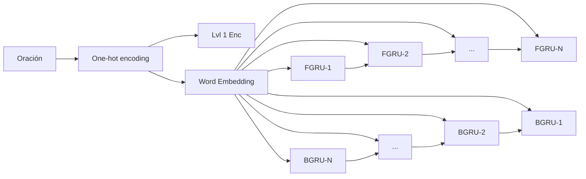

# Dual Encoding for Zero-Example Video Retrieval
## Descripción detallada del problema
Descripción detallada del problema que enfrenta el artículo: deben indicar la motivación del artículo, el problema que trata de resolver, por qué el problema es relevante y definirlo como un problema de Aprendizaje de Máquina (definido como input y output).
### Motivación
La motivación del artículo es poder crear un modelo que sea capaz de codificar palabras e imágenes bajo una misma representación sin la necesidad de extraer conceptos relevantes que  generan relaciones entre ambos contextos. En otras palabras, el modelo debe ser capaz de entender la semántica entre ambos dominios a partir de un método libre de contexto.

Esto resulta ser interesante al momento de extrapolar este problema, ya que entrega evidencia que se pueden relacionar dos dominios distintos sin la necesidad de extraer características relevantes de alguno de los dos, teniendo en cuenta que se considera la variable temporal entre ambos dominios.

### Problema
El problema que se aborda es el de conseguir un set de frames de video que representan un evento y éste es descrito semánticamente a partir de una *query* en forma de lenguaje natural.

La hipótesis del artículo es que dado un video o una query, en primera instancia, estos deben ser codificados en una poderosa representación por si mismo para luego aprovechar ambas representaciones con un modelo de redes neuronales [[1]].

[1]: https://arxiv.org/pdf/1809.06181.pdf

El artículo tiene suma **relevancia** al cambiar el paradigma de los modelos basados en conceptos, los cuales automáticamente detectan los conceptos relevantes y los asocian a un evento en particular. Para estos tipos de modelos se tiene la dificultad de escoger los conceptos para poder entrenarlos, ya que no es tarea simple escoger conceptos que se puedan detectar y además representar a ambos dominios simultáneamente.

Este problema se puede definir según un problema de ***Aprendizaje de Máquina*** de la siguiente manera. Existen dos modalidades de inputs con sus respectivas modalidades de outputs.

Para la primera modalidad, el input es una oración en lenguaje natural, es decir, una composición de palabras. En este caso, el output es un set de frames de video, o un conjunto de imágenes, que representan la semántica del input.

La segunda modalidad es el caso en que el input está dado por un set de frames de video y el output es una oración en lenguaje natural que describe el fragmento de video que fue entregado como input.

Finalmente, quiero dejar en claro que la réplica del paper se hará en primera instancia con la primera modalidad recién descrita y realizar la segunda modalidad si y solo si es directo llevarlo a cabo una vez completada la primera.

## Descripción detallada de las métricas
Deben describir las métricas que usan en el artículo para medir el desempeño de la solución. No solo deben enumerar los nombres de las métricas si no investigar a qué se refiere cada una y definirla formalmente (muchos artículos usan métricas que van mucho más allá de acierto o precisión). Deben además decidir qué métricas son las que usarán ustedes en su replicación. Algunos artículos usan muchas métricas distintas. En su caso, basta con que seleccionen un par de las mencionadas en el artículo.
**Recall (R@num)**
**Med r**
**mAP**
**infAP**

## Descripción de los datos utilizados
Deben investigar qué datos usaron los autores para medir la eficacia de su solución, deben descargarlos para poder analizarlos, describirlos (tamaño, tipo de datos, composición, etc.) y, siempre que sea posible, dejarlos en su repositorio, o de otra forma indicar cómo se deben descargar y procesar. Como plus, deben construir un DataSet y un DataLoader para los datos (o buscar si es que existe alguno disponible en la Web).

A partir del código que se encuentra en el github del paper (link), logré identificar el dataset que utilizaron para entrenar y probar el modelo dual encoding, al igual que los embeddings necesarios.

**MSR-VTT Dataset**
Se utiliza el dataset MSR-VTT que contiene 10.000 *video clips* con 200.000 *oraciones de lenguaje natural* que describen el contenido de los videos. En promedio, se tienen 20 oraciones por video. La partición que se realiza para los datos de training, validation y testing son 
6.513, 497, 2.990 respectivamente.

**Vocabulario/Bag of Words (BoW)**
Para el uso de los embeddings, es necesario extraer el vocabulario del training set. Para esto, ejecuté el script *vocab.py* del repositorio el cual generó una vocabulario con **cantidad** palabras.

**WordtoVec (W2V)**

**Video to Frames (V2F)**

Los datos se pueden descargar ejecutando las celdas correspondientes del siguiente Colab (link a colab). En este mismo link, también se puede observar el análisis de los datos que mencioné con anterioridad.

Además, encontré el código de los Dataloaders que utilizan en el paper, también adjuntos en el link de Colab. 

(Eliminar estos de acá abajo)
**TRECVID Ad-Hoc Video Search task (last 2 years) **.
4,593 Internet Archive videos with
duration ranging from 6.5 min to 9.5 min and a mean du-
ration of almost 7.8 min.
Como no tiene set de entrenamiento, se entrena con **MSR-VTT** y **TGIF**.
100K animated GIFs and 120K sentences describing visual
content of the GIFs
**MSVD**. for cross-dataset generalization
**MPII-MD**. cross-domain generalization

## Descripción de la arquitectura
Deben describir la arquitectura de Deep Learning usada por los autores para resolver el problema. Idealmente entender y enumerar las fórmulas usadas en la arquitectura. Si las fórmulas o la arquitectura son muy complicadas, pueden sólo incluir una descripción de alto nivel, pero procuren juntarse con su tutor para que los guíe en el entendimiento de la arquitectura.
La arquitectura que se describirá es para el caso en que el input es una oración de lenguaje natural y el output son frames del video correspondiente a lo descrito por el input (primera modalidad de la introducción).

## Repositorio de código
[Github Dual Encoding Zero-Example Video Retrieval](https://github.com/gpilleux/DualEncZeroExVidRetriev)

